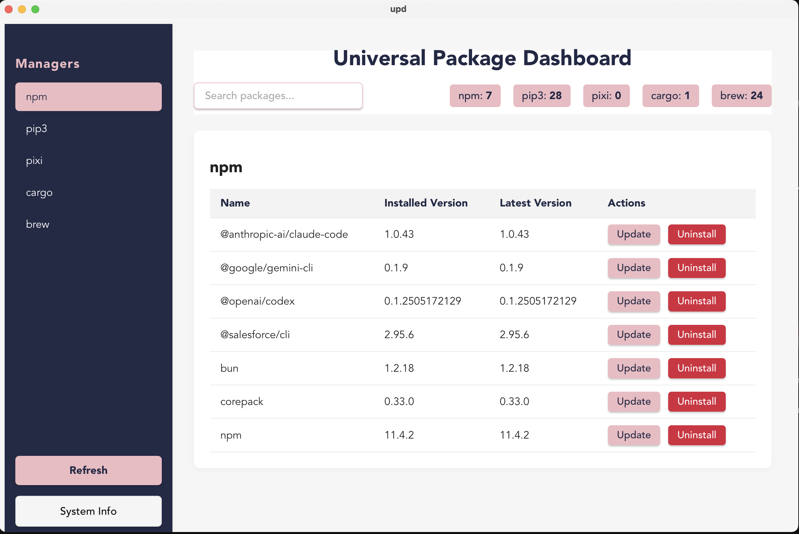
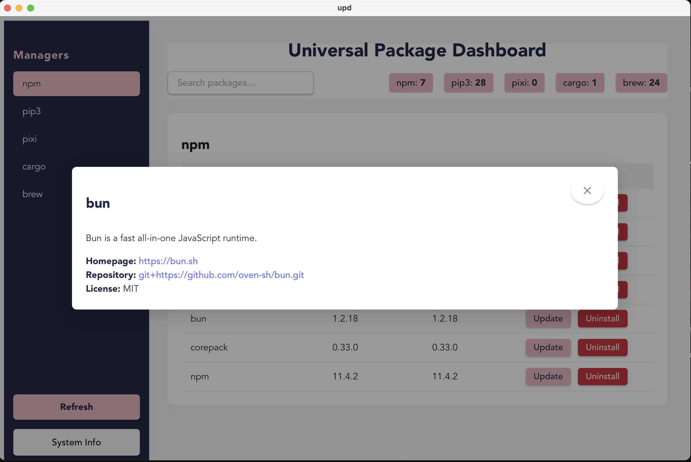
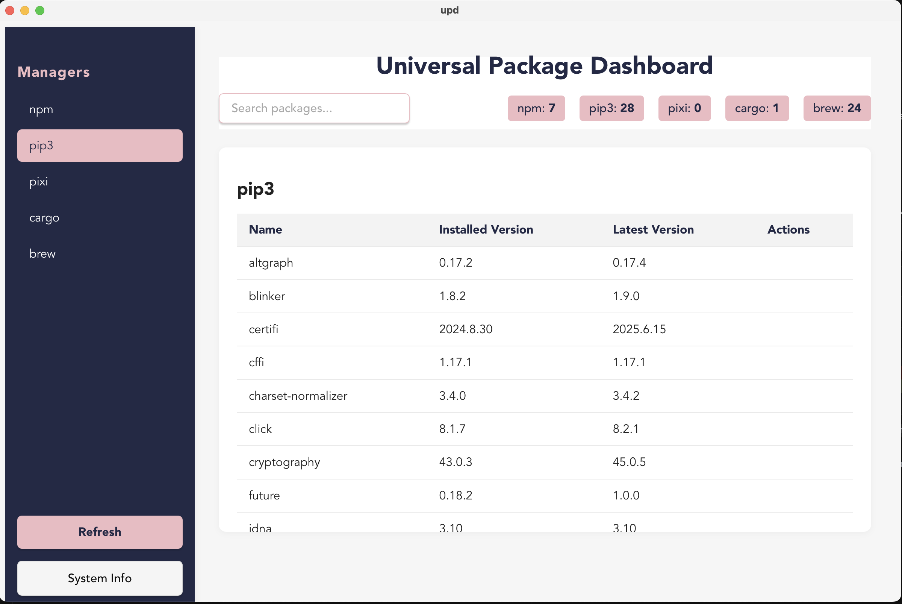
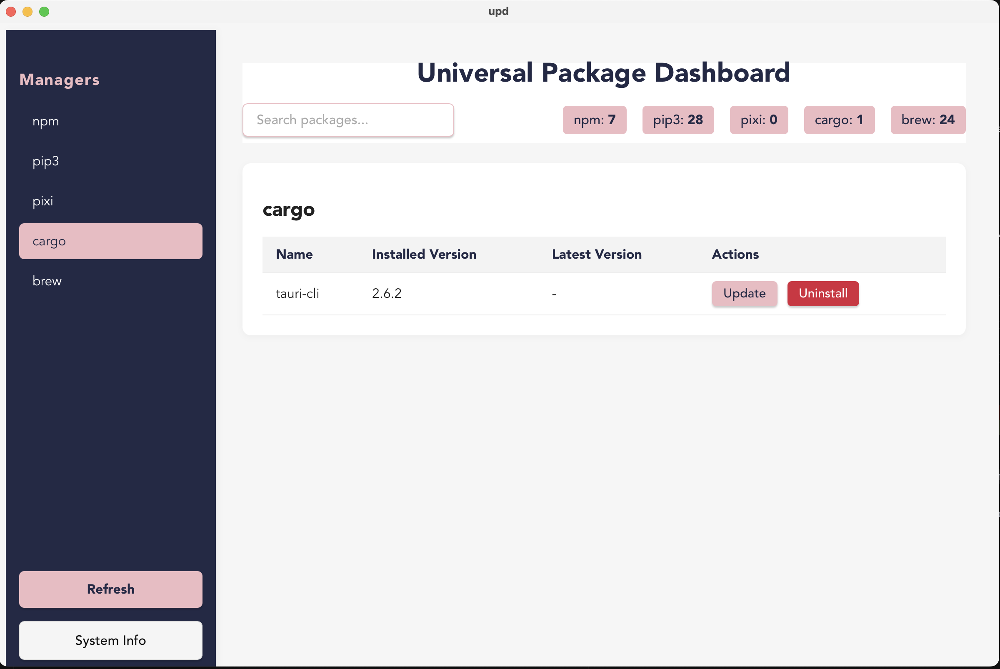
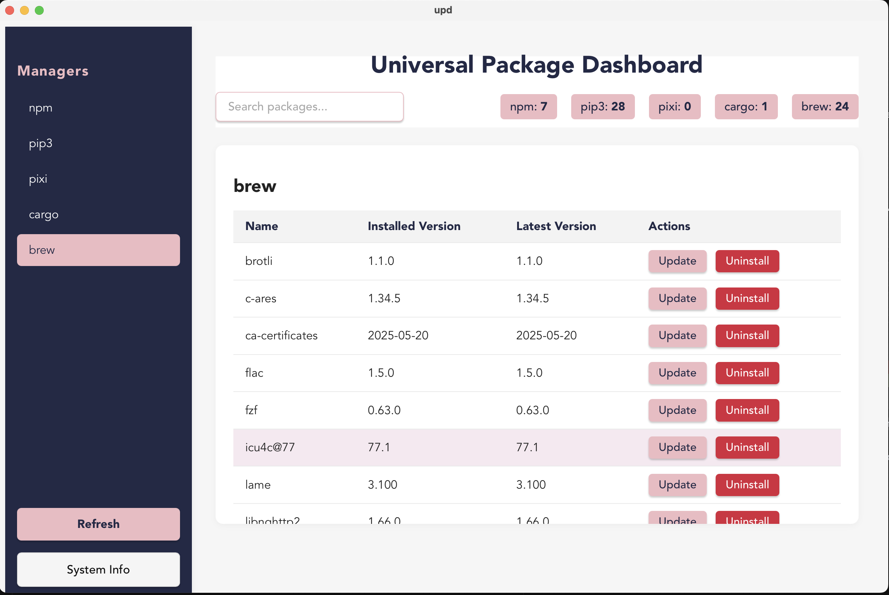
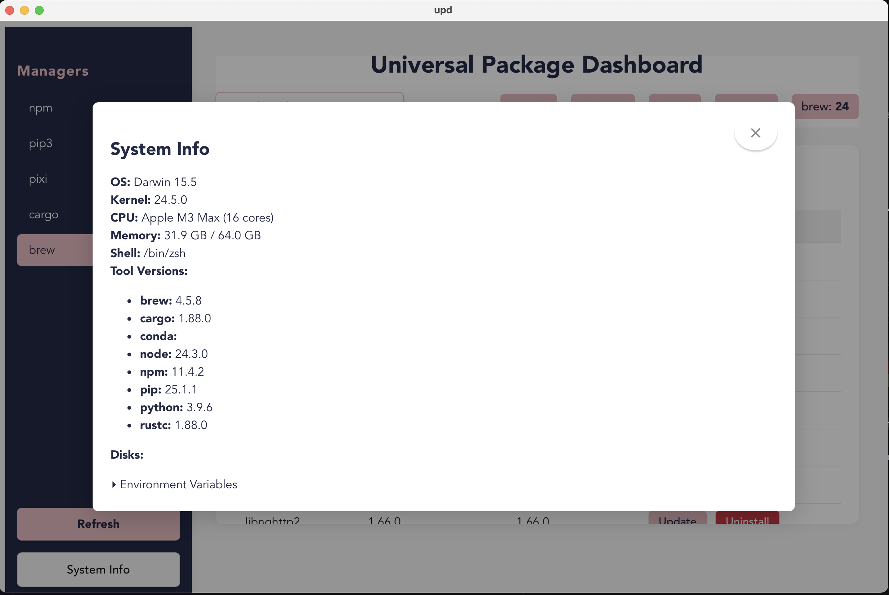

# Universal Package Dashboard (UPD)

A modern, cross-platform desktop app to view, update, and manage packages from multiple package managers in one place.

---

## ✨ Features
- **Unified Dashboard:** See all your packages from npm, pip, pip3, cargo, brew, and more.
- **Modern UI:** Clean, responsive interface built with Blazor and Tauri.
- **Package Actions:** Update or uninstall packages with one click.
- **Package Details:** Click any package for rich info, changelogs, and dependencies.
- **System Info:** View OS, CPU, RAM, tool versions, and environment variables.
- **Fast & Native:** Rust backend for speed, Blazor frontend for flexibility.

---

## 🚀 Getting Started

### Prerequisites
- [Rust](https://www.rust-lang.org/tools/install)
- [Node.js](https://nodejs.org/) (for Tauri dev)
- [.NET 9 SDK](https://dotnet.microsoft.com/en-us/download/dotnet/9.0)
- [Tauri CLI](https://tauri.app/v1/guides/getting-started/prerequisites/): `cargo install tauri-cli`

### Install & Run (Development)
```bash
# Clone the repo
 git clone https://github.com/shahrier/upd.git
 cd upd

# Restore .NET dependencies
 dotnet restore src/Upd.csproj

# Start the Tauri app (dev mode)
 cd src-tauri
 cargo-tauri dev
```

---

## 🛠️ Build a Release
```bash
cd src-tauri
cargo tauri build
```
- The executable will be in `src-tauri/target/release/bundle/` (macOS: `.app`, Windows: `.exe`, Linux: `.AppImage`/`.deb`)

---

## 📦 Supported Package Managers
- npm
- pip / pip3
- pipx
- pixi
- cargo
- brew

---

## 🖥️ Screenshots








---

## 🙏 Contributing
PRs and issues welcome!

---

## 📄 License
MIT

---

## 💡 Roadmap / Ideas
- Add install package support
- More package managers
- Auto-update checks

---

## Author
[Shahrier Emon](https://github.com/shahrier)

---

## ⭐ If you like it, star it!
